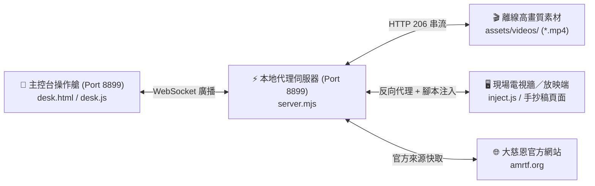

# AMRTF-Desk (大慈恩手抄稿研討智能導播系統) - 專案藍圖與架構規格

---

## 一、 系統願景與設計哲學 (Vision & Principles)

**AMRTF-Desk** 是專為僧團與研討會打造的「廣播級手抄稿研討智能導播系統」。
系統實現了現場大螢幕「放映端」與講桌 / 導播席「主控台」的完全解耦與微秒級雙向同步控制：

1. **主控端 (Controller Desk)**：以純符號、高對比、0 贅字設計，提供極速講次切換、A-B 區間循環、段落急煞定格、語句微循環與純淨影音播放。
2. **放映端 (Display Screen)**：基於大慈恩官方手抄稿 DOM 結構，經本地代理伺服器（Port 8899）深度注入微秒級時間戳解析、平滑捲動引擎、全螢幕劇院放映遮罩與 1080p 離線影音秒播。
3. **通訊核心 (Full-Duplex WS)**：雙向 WebSocket 實時廣播，手機／平板／筆電透過區域網路 IPv4 QR Code 掃碼即控，0 延遲。

---

## 二、 核心架構與連接埠分配 (Architecture & Ports)

* **本機服務埠：** `http://localhost:8899`（或 LAN IP 如 `http://192.168.0.83:8899`）
* **大螢幕放映端：** `http://localhost:8899/?lesson=0566`
* **主控台操作艙：** `http://localhost:8899/desk.html`
* **持久化儲存：** `last-lesson.json`（持久化記錄當前最新研討講次）

---

## 三、 已交付里程碑與核心技術亮點 (Completed Milestones)

- [x] **講次 4 碼智能格式化**：輸入 `1`、`20`、`300` 自動補零為 `0001`、`0020`、`0300`，`0566` 原樣保留，對齊官方 4 碼 URL 格式。
- [x] **動態逐字字幕 (LRC) 引文跳轉與 A-B 區間循環**：
  - 破譯大慈恩真實 DOM：解析 `<blockquote>` 內部的 `data-s` / `data-e` 毫秒級時間戳；
  - 實裝多段引文感知切換：`#引文` 一按跳轉至當前/下一段師父開示引文起點；
  - 實裝 **智能尾部緊縮（Smart Tail Trimming）**：在師父講完後、老師開口前（預留 0.6s~4.6s 安全緩衝）俐落倒帶，徹底根除循環時洩漏下方老師開示聲音問題。
- [x] **段落微循環重構**：將固定死板的 -10s/+15s 升級為以當前語句為中心的「前三句 + 當前句 + 後三句」動態語音短句鎖定（共 7 句，約 15~25 秒），點擊一按立即自動倒帶至前三句起點開播，字詞 100% 完整不腰斬。
- [x] **播稿／捲動深淺色狀態即標籤與影片自動全螢幕**：頂部移除重複徽章，播稿與捲動按鈕直顯狀態（手動/OFF 為淡色，持續/區段/ON 為深色）；重構影片彈窗管線，開片自動全螢幕，開啟前清空舊彈窗徹底根絕連續點擊關閉失效 Bug。
- [x] **方案 A 獨立全螢幕劇院放映引擎**：徹底跳脫 WordPress 舊外掛束縛，建構 100vw x 100vh 純黑全螢幕覆蓋層；深度整合 YouTube IFrame API 監聽 ENDED 播完事件，實現「點擊影片 ➔ 100% 自動全螢幕播放 ➔ 播完 0 延遲自動退出全螢幕回到手抄稿原位」，中途隨時按關片亦平滑退出。
- [x] **方案 3 本機原生零雜訊影音秒播引擎（Zero-OSD Local Video Engine）**：
  - 本地離線資產就緒：下載 1080p 密集嘛、前行、迴向高畫質 MP4 素材置於 `assets/videos/`；
  - 實裝 HTTP 206 串流與 HEAD 探測，0 秒秒開秒跳；
  - 徹底拔除右上角關閉字樣、消滅拼音/中文外掛字幕與頂部標題雜訊，100% 廣播純黑淨化；
  - 內建 YouTube API 雙軌降級備援，永不黑屏。
- [x] **最新講次開機即達、真實 LAN IP QR Code 與段落區間播映雙選單**：
  - 啟動預設最新講次：自動探測大慈恩最新講次（如 0566）並持久化記憶研討進度；
  - 真實區域網路 IPv4：自動感知 Wi-Fi/LAN IP（如 192.168.0.83），手機掃碼 100% 順暢直連；
  - 手抄稿段落「起訖雙下拉選單」：解析整篇各段秒數時間戳，支援精準播映至指定秒數自動停駐與循環。
- [x] **播稿與持續捲動開機自律引擎（Startup Default State Enforcer）**：
  - 放映端非同步高頻自律哨（150ms 輪詢至多 50 次）：自動將 `#bottom_toolbar_speechmode` 鎖定為 `ON`，並在音訊就緒後安全切換 `#bottom_toolbar_autoscroll-1`（持續）；
  - **四重護欄防禦**：實裝音訊就緒閘門（Audio Ready Gate）、預寫 LocalStorage、全域 Alert 靜默吸收器，以及 `startAutoScroll` 劫持定格防暴走（Pause Guard），徹底消除官方 `alert` 阻塞彈窗並根絕「未按播放畫面就自己往下跑」Bug；
  - 指令集擴充：支援 `set_speech_mode` 與 `set_scroll_mode` 絕對直傳控制；
  - 主控台操作艙同步：`index.html` 與 `desk.js` 首屏預設為深色 `.active-deep` 且文字直顯「🗣️ 播稿」與「📜 持續」，開機瞬間零閃爍且未播放前畫面 100% 紋絲不動。
- [x] **區間急煞定格機制與起訖選單單向防死鎖約束**：
  - **段落結尾標籤精確收斂**：徹底拔除 `span.lrc` 與逐字句標籤（`data-s`），精準鎖定手抄稿每段末尾的 `span.seek-to[data-time]` 與 `a.mvt[data-t]`，將起訖選項從碎裂的 300+ 句收斂為 23 個黃金大段落標記；
  - **高精細 20ms 急煞哨兵 (`intervalPollTimer`)**：突破 HTML5 原生 `timeupdate` 250ms 滯後盲區，改由 20ms 微秒哨兵高頻巡檢；
  - **段尾 0.25s 靜音處俐落急煞**：在訖點倒數 0.25 秒微靜音處俐落結算，徹底消除瀏覽器解碼緩衝吃進下段 1 秒首音與下段滾動跑出來之毛刺；
  - **三重急煞定格引擎 (`freezeScroll`)**：全面清空 jQuery 動畫隊列（`jQuery('*').stop(true, false)`）並銷毀 `stepScrollTimer`、`lrcTimer`、`lrcNextTimer`；配合 `isIntervalStoppedJustNow` 狀態閘門，劫持截斷官方 `startAutoScroll` 遞迴；
  - **連續多波次煞車補強**：在到達訖點時連續觸發 50ms、150ms、300ms 煞車波次，達到「音訊一停、畫面瞬間紋絲不動」；
  - **起訖單向智慧約束 (`updateIntervalOptionsConstraints`)**：解開雙向夾擊互鎖死結，選定「起」時僅約束「訖」（早於起點者 disabled），選定「訖」時僅約束「起」（晚於訖點者 disabled），起點選單所有段落完全開放自由可見。

---

## 四、 規格文件與架構檔案清單 (Documentation)

* **技術規格書：** [docs/specs/SPEC-004-amrtf-desktop-controller.md](file:///d:/AI-made/projects/amrtf-desk/docs/specs/SPEC-004-amrtf-desktop-controller.md)
* **工程微工單：** [docs/specs/TICKETS-004-amrtf-desktop-controller.md](file:///d:/AI-made/projects/amrtf-desk/docs/specs/TICKETS-004-amrtf-desktop-controller.md)
* **開發與踩坑日誌：** [DEVLOG.md](file:///d:/AI-made/projects/amrtf-desk/DEVLOG.md)
* **參考模組：** [docs/references/companion-module-amrtf-website/](file:///d:/AI-made/projects/amrtf-desk/docs/references/companion-module-amrtf-website/)
