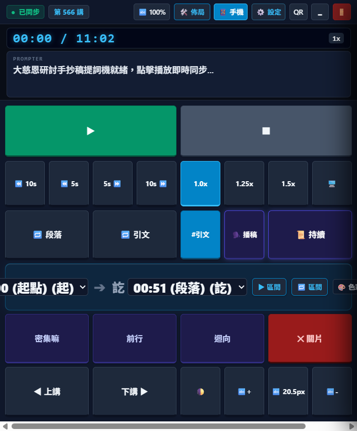
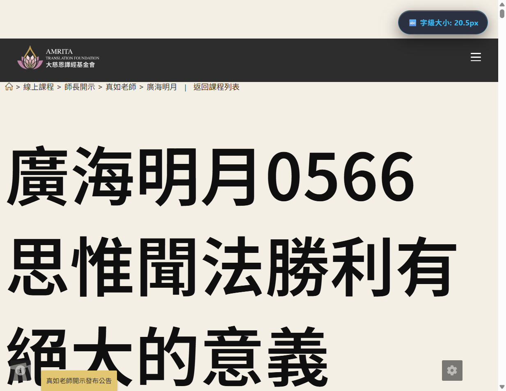
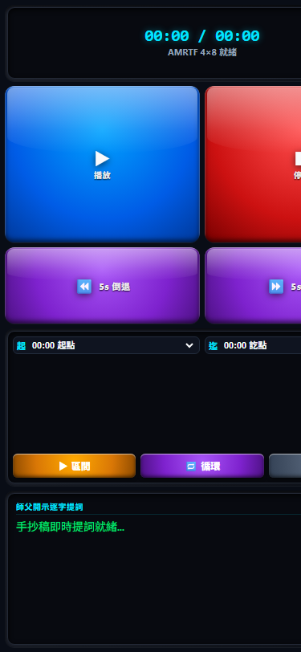
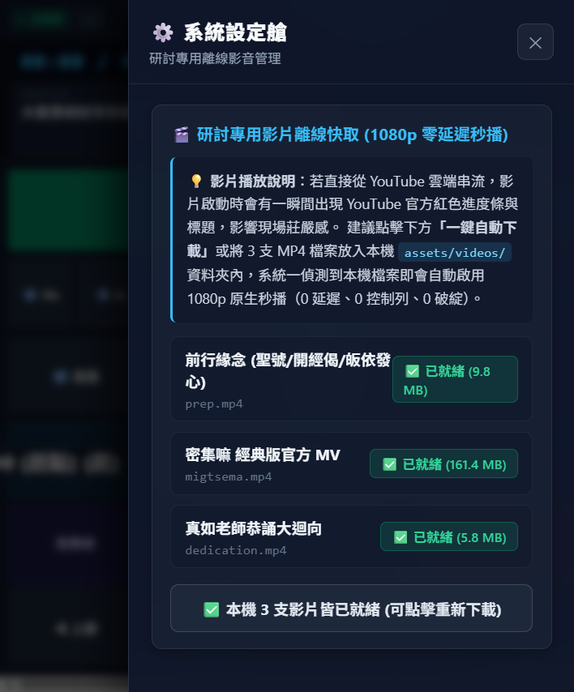
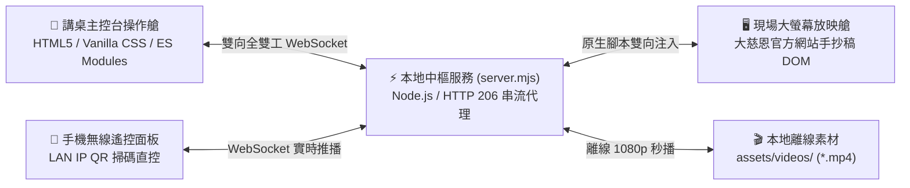

# AMRTF-Desk ☸️ 大慈恩研討智能導播系統

> **專為廣論、廣海明月研討班量身打造的廣播級智能導播播控艙**  
> 實現「現場大螢幕放映」與「講師主控台」徹底解耦、微秒級雙向同步，支援手機掃碼即控！

---

## 🌟 為什麼需要 AMRTF-Desk？

過去在僧團或研討班主持手抄稿研討時，主持人與幹部往往面臨諸多痛點：
* ❌ **切換手忙腳亂**：在大螢幕上翻找講次、拉動拉桿，台下學員看著滑鼠游標在投影幕晃動，破壞現場莊嚴氣氛。
* ❌ **播稿滾動難以掌控**：字體放大了卻容易擋住、字級按了反而縮回最小、手動滾輪一滾又跑過頭。
* ❌ **剛才一句沒聽清**：想倒帶卻只能粗暴倒退 10 秒或手動拉進度條，常常把上一句話或這句話腰斬，聽不清楚。
* ❌ **引文與前行影片繁瑣**：切換前行、密集嘛、迴向影片時，YouTube 介面跳出紅條、廣告或相關推薦影片，干擾研討沈浸感。

**AMRTF-Desk（大慈恩研討智能導播系統）** 徹底解決了這一切！

---

## 📸 介面與功能導覽

### 1. 📱 講師主控操作艙（講桌／導播席）
講師與音控人員使用的專屬操作台，高對比、0 贅字、純按鈕與指示燈設計，所有功能皆可一鍵必殺：

* **講次極速切換**：數字鍵盤隨打即跳（輸入 `566` 自動對齊 `0566`，秒開新講次）。
* **手抄稿起訖區間播映**：收斂整篇手抄稿為黃金大段落，下拉選定起點與訖點，播到訖點前 0.25 秒微靜音處自動煞停定格，畫面 100% 紋絲不動！
* **語意連貫微復讀**：剛才沒聽清？一按立即智能倒帶回「前三句起點」，字句 100% 完整不被腰斬。
* **師父開示引文 A-B 循環**：智能偵測師父講話時間範圍，師父講完、老師開口前俐落倒帶，絕不洩漏老師聲音。
* **離線高畫質 1080p 秒播**：密集嘛、前行、迴向按鈕一鍵秒播，全螢幕純淨播放，播完 0 延遲自動退回手抄稿。

---

### 2. 🖥️ 現場放映艙（投影機／電視牆大螢幕）
面向所有研討同修的大螢幕視窗，尊重大慈恩原汁原味排版，字體清晰舒展：

* **100% 官方原生字級縮放**：對標大慈恩官方拉桿規格（10~22px / 步進 1.5），告別外來樣式覆蓋，字體放大平滑莊嚴。
* **逐字高亮與自然滾動**：原廠 LRC 逐字高亮，音訊推進手抄稿自動跟進，台下學員一目了然。
* **雙向狀態即時反映**：無論在網頁端拉動拉桿，或是從主控台點擊按鈕，雙邊狀態微秒級精準同步。

---

### 3. 📶 手機無線遙控（教室走動自在引導）
主控台點擊「QR」，講師拿起手機掃描相機即可開啟專屬行動遙控面板：

* 免安裝 App，瀏覽器打開即用。
* 隨身在教室走動、與同修互動時，隨時拿著手機暫停、倒帶或跳轉段落！

---

### 4. ⚙️ 系統設定艙（離線影音一鍵備妥）
點擊主控台「⚙️ 設定」，即可進行專用影音管理：

* **離線影音快取管理**：前行、密集嘛、迴向 MP4 本地狀態一覽。
* **一鍵自動下載**：自動下載最新 1080p 高畫質檔案至本機 `assets/videos/`，免除手動翻找困擾。

---

## 📦 下載與安裝教學（免安裝綠色版）

本軟體為**完全免安裝的綠色免配置版本**，下載 ZIP 壓縮檔解壓即用，絕不修改系統登錄檔。

### 第一步：下載 ZIP 壓縮檔
1. 前往 GitHub 右側的 **[Releases](../../releases)** 發布頁面。
2. 下載最新版本的壓縮包，例如：**`AMRTF-Desk-v1.0.0.zip`**。

### 第二步：解壓縮至您的電腦
1. 在下載回來的 `AMRTF-Desk-v1.0.0.zip` 上按**滑鼠右鍵** ➔ 選擇**「解壓縮全部...」**。
2. 建議解壓至單純的路徑（例如 `D:\AMRTF-Desk` 或 `C:\AMRTF-Desk` 或桌面）。
> ⚠️ **溫馨提醒**：請務必先解壓縮，**不要**在 ZIP 壓縮包內部直接點擊執行，以確保程式能正確讀取設定與影片資源。

### 第三步：一鍵啟動研討系統
解壓完成後，打開資料夾，您會看見以下捷徑與檔案：

| 檔案名稱 | 用途說明 |
| :--- | :--- |
| 🚀 **`啟動大慈恩研討艙.bat`** | **主要啟動入口**：雙擊即可自動拉起後端服務、開啟主控台與放映艙。 |
| 📌 **`建立桌面捷徑.bat`** | **桌面捷徑產生器**：雙擊後會在您的 Windows 桌面自動產生專屬捷徑，日後從桌面即可直接啟動！ |
| ⚙️ **`AMRTF-Desk.bat`** | 快速本機執行批次檔。 |

> 💡 **環境需求**：
> - 作業系統：Windows 10 / Windows 11（64 位元）
> - 瀏覽器：已安裝 Google Chrome 或 Microsoft Edge（系統預設皆有）。

---

## 🎯 現場雙螢幕操作指引 (Dual-Screen Setup)

在教室進行研討時，強烈建議搭配投影機或雙螢幕使用：

1. **接上投影機或外接螢幕**：將 HDMI 或 Type-C 線接上投影幕。
2. **切換為延伸螢幕模式**：
   - 按下鍵盤快捷鍵：**`Win + P`**
   - 選擇 **「延伸 (Extend)」**。
3. **分配視窗**：
   - 雙擊 `啟動大慈恩研討艙.bat` 後，系統會為您開啟兩個視窗：
     - **視窗一（放映端）**：將此視窗拖曳至外接的**投影幕／電視牆**，並按下視窗右上角或按 `F11` 進入全螢幕放映。
     - **視窗二（主控台）**：將此視窗保留在**講師筆電本機螢幕**，供主持人隨時點擊操作。
4. **大功告成**：台下同修只會看到乾淨莊嚴的手抄稿與流暢字幕，講師則可從容優雅地操作每個段落！

---

## 📖 核心操作技巧一覽

### 1. 極速更換研討講次
- 在主控台點擊右上角「`# 566`」或左側數字鍵盤。
- 輸入講次號碼（例如輸入 `3` 或 `504`），按確認後，放映端將在 1 秒內自動載入對應手抄稿與音檔！

### 2. 手抄稿段落播映 (起訖選單)
- **起點選單**：選擇研討想開始的段落（例如 `05:13 第 4 段`）。
- **訖點選單**：選擇研討想結束的段落（系統自動智慧防呆，訖點絕不會早於起點）。
- 點擊 **`▶ 播放區間`**：音檔將精準播到訖點前 0.25 秒微靜音處俐落急煞，畫面定格紋絲不動。
- 點擊 **`🔁 循環區間`**：播到訖點後自動倒回起點重播，非常適合逐段深入研討。

### 3. 微復讀與師父引文
- **`🔁 微復讀 (前3句+當前句+後3句)`**：同修聽不清楚剛才這幾句時，按此鍵立即倒帶回前三句開頭，字詞完好連貫。
- **`# 師父引文`**：手抄稿中若有引述《菩提道次第廣論》或師父音檔開示，點擊直接跳至引文起點；再按一次跳至下一段引文。
- **`🔁 引文循環`**：師父引文播放完畢時俐落折返，不洩漏老師後續話語。

### 4. 專用影音秒播
- **`🎬 前行`**：三稱本師聖號、開經偈、大乘皈依發心（秒開秒播）。
- **`🎬 密集嘛`**：宗喀巴大師祈請文經典版官方 MV。
- **`🎬 迴向`**：真如老師恭誦大迴向。
> 點擊後全自動 100% 全螢幕播出，播完 0 延遲自動退回手抄稿原段落！

---

## ❓ 常見問題排解 (FAQ)

#### Q1：按下載影片時，為什麼提示影片皆已就緒？
* **答**：壓縮包內若已預載了 1080p 離線影片，設定艙中會顯示「✅ 已就緒」，此時系統播放時會直接調用本地高畫質檔案，不需要再次下載。若需重新下載，可再次點擊按鈕。

#### Q2：手機掃描 QR 碼連不上主控台？
* **答**：請確保手機與電腦連在**同一個 Wi-Fi 區域網路**（例如研討教室同一個無線路由器）。若是公共網路（如部分設有訪客隔離的 Wi-Fi），手機與電腦可能無法直接通訊，此時建議使用手機開啟熱點分享給筆電。

#### Q3：手抄稿字體大小怎麼調整？
* **答**：在主控台點擊「`🔤 16px`」字級按鈕，即可在官方原生推薦檔位 `13px ➔ 16px ➔ 19px ➔ 22px` 之間循環切換；亦可按旁邊的 `[ + ]` 與 `[ - ]` 進行微調。

#### Q4：防毒軟體彈出安全提示怎麼辦？
* **答**：本專案為開源純腳本架構，批次檔（.bat）僅調用系統標準指令拉起瀏覽器與本地伺服器，絕無任何惡意代碼。若 Windows Defender 提示「已保護您的電腦」，請點選**「其他資訊」➔「仍要執行」**即可。

---

## 🛠️ 技術棧與架構

* **通訊核心**：雙向全雙工 WebSocket，信令差集為 0。
* **影音串流**：HTTP 206 Partial Content 分段秒播，支援離線 MP4 與 YouTube IFrame 雙軌備援。
* **測試護欄**：Live Reality E2E 四重硬鎖（HWND 視窗實體、CDP 幾何渲染、DOM 樣式差分、真機截圖存證），全量 23 項測試 100% PASS。

---

## 📄 授權條款 (License)

本專案基於 **MIT License** 開源發布，歡迎各研討班、同行同修自由下載、使用與流通。  
願以此系統之開發與使用功德，迴向正法久住、師長法體安康、研討同修聞思增上！
