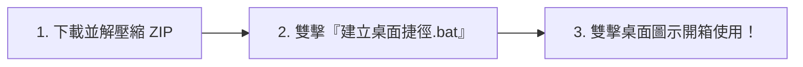
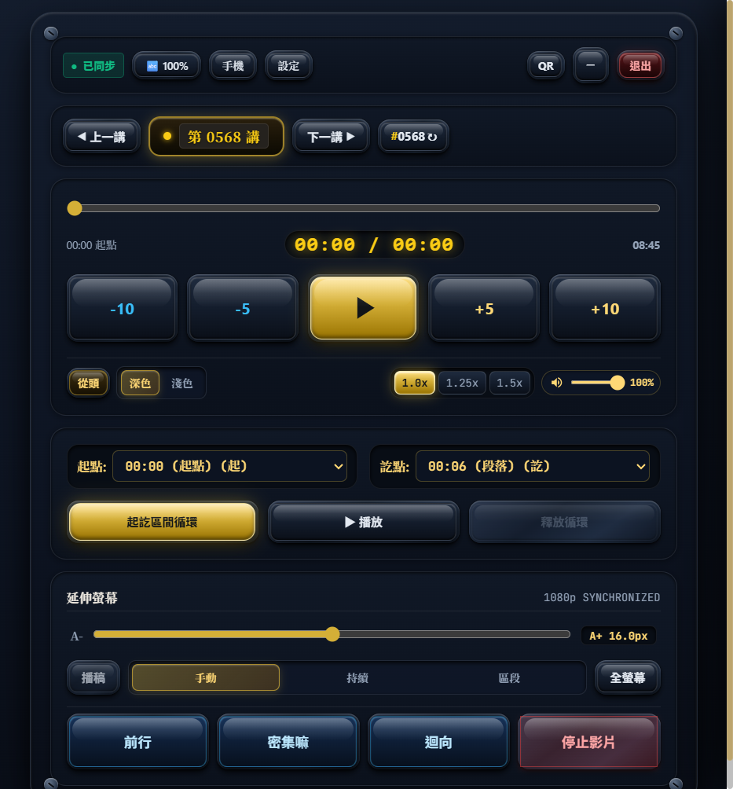
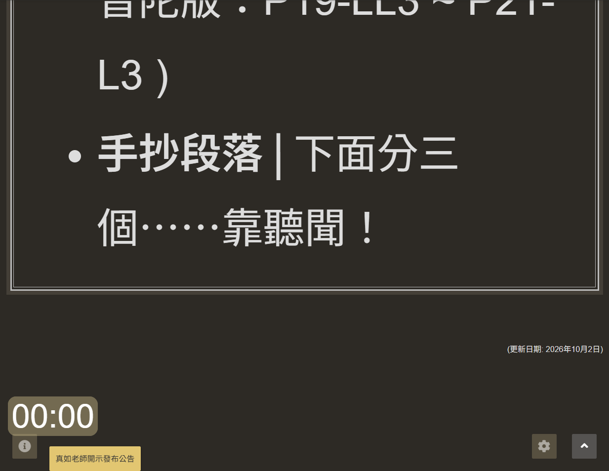
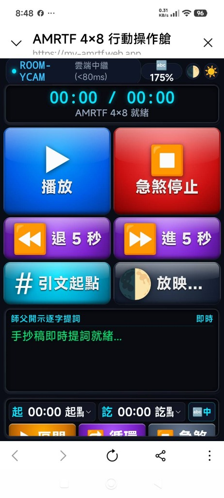
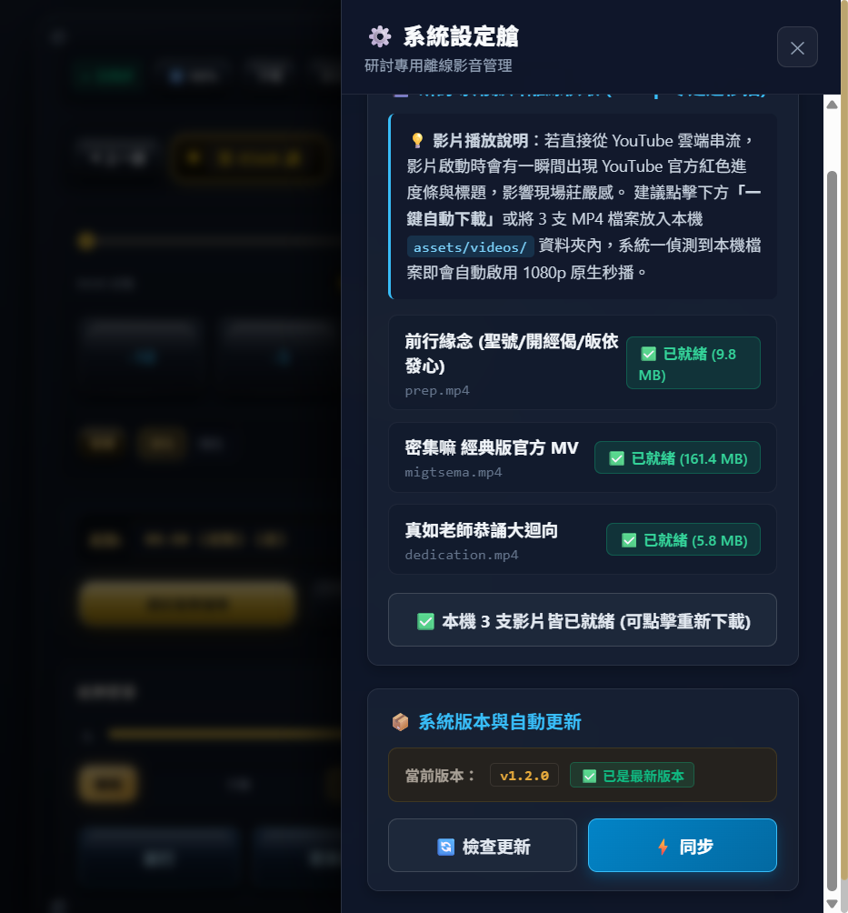

# AMRTF-Desk ☸️ 大慈恩研討智能導播系統

> **專為廣論、廣海明月研討班量身打造的廣播級智能導播播控艙**  
> 實現「現場大螢幕放映」與「講師主控台」徹底解耦、微秒級雙向同步，支援手機 100% 密碼學純掃碼直通！

---

## 🌟 為什麼需要 AMRTF-Desk？

過去在研討班主持廣論、廣海明月手抄稿研討時，主持人與幹部往往面臨諸多痛點：
* ❌ **切換手忙腳亂**：在大螢幕上翻找講次、拉動拉桿，台下學員看著滑鼠游標在投影幕晃動，破壞現場莊嚴氣氛。
* ❌ **現場 Wi-Fi AP 隔離**：教室網路常禁止設備互聯，手機常常連不上筆電，無法走動導播。
* ❌ **播稿滾動難以掌控**：字體放大了卻容易擋住、字級按了反而縮回最小、手動滾輪一滾又跑過頭。
* ❌ **剛才一句沒聽清**：想倒帶卻只能粗暴倒退 10 秒或手動拉進度條，常常把上一句話或這句話腰斬，聽不清楚。
* ❌ **引文與前行影片繁瑣**：切換前行、密集嘛、迴向影片時，YouTube 介面跳出紅條、廣告或相關推薦影片，干擾研討沈浸感。

**AMRTF-Desk（大慈恩研討智能導播系統）** 徹底解決了這一切！

---

## 📦 第一次安裝與使用（30 秒極簡 3 步驟）

本系統為 **100% 綠色免安裝軟體**，無須複雜驅動、不改動系統登錄檔：

```mermaid
graph LR
    A["1. 下載並解壓縮 ZIP"] --> B["2. 雙擊『建立桌面捷徑.bat』"]
    B --> C["3. 雙擊桌面圖示開箱使用！"]
```

### 步驟 1：下載並解壓縮
* 前往 GitHub **[Releases](https://github.com/ytrt6545ytrt6545/amrtf-desk/releases)** 下載最新版綠色便攜壓縮包（例如 `AMRTF-Desk-v1.2.0-Portable.zip`）。
* 解壓縮至電腦任意慣用目錄（建議解壓縮至 `D:\AMRTF-Desk` 或桌面，路徑盡量避免特殊符號）。

### 步驟 2：一鍵建立桌面捷徑
* 打開解壓縮後的資料夾，找到並雙擊執行：**`建立桌面捷徑.bat`**。
* 系統將自動抓取當前資料夾的真實絕對路徑，在 Windows 桌面上自動產生**「大慈恩研討播控艙」**正式專屬曜金圖示捷徑。

### 步驟 3：開箱日常使用
* 日後每次研討時，直接在桌面雙擊**「大慈恩研討播控艙」**圖示即可一鍵啟動！
* 系統將自動拉起兩個視窗：
  1. 🖥️ **現場放映艙**：自動獨佔第二螢幕/投影機，台下學員看見的是純淨的大字手抄稿與影片。
  2. 🎛️ **講師主控操作艙**：留在筆電螢幕，供主持人從容點擊操作。

> 💡 **如果您已經安裝過舊版？**  
> 完全可以再次執行！新版直接解壓縮覆蓋原資料夾，或解壓至新目錄後雙擊 `建立桌面捷徑.bat`，系統會自動將桌面捷徑導向最新版本，舊設定與快取完全相容。

---

## 🗑️ 如何解除安裝？（100% 綠色零殘留）

因為 AMRTF-Desk 是標準的綠色免安裝設計：
1. **刪除捷徑**：在 Windows 桌面上，對「大慈恩研討播控艙」圖示按右鍵 ➔ **刪除**。
2. **刪除資料夾**：直接將當初解壓縮的「AMRTF-Desk」整個資料夾刪除進資源回收筒。
3. **完成！** 電腦完全恢復原狀，乾淨無比、絕不殘留任何系統垃圾。

---

## 📸 介面與功能導覽 (v1.2.0 最新功能)

### 1. 🎛️ 講師主控操作艙（講桌／導播席）
高對比、0 贅字、純按鈕與指示燈設計，所有功能皆可一鍵必殺：

#### 核心重點功能：
* **🎵 音訊進度條滑動拖曳尋軌 (Scrubbing)**：主控台頂部進度條即時滑動拖曳，雙向微秒級同步跳轉放映端，時間碼即時聯動。
* **🌗 放映端深淺色雙聯切換**：獨立控制外接大螢幕主題：
  - `淺色`：大慈恩原汁原味宣紙雅白（適合白天或明亮研討教室）。
  - `深色`：曜石玄木夜間護眼暗黑（適合關燈或高對比投影幕環境）。
* **📜 手抄稿滾動模式三聯鍵**：
  - `手動`：完全由操作員手動翻閱，音檔播放時不強行位移，同修可安心細看上下文。
  - `持續`：音檔播放時手抄稿自動跟進、逐字自然平滑滾動。
  - `區段`：鎖定在當前研討段落起訖區間內滾動。
* **🛑 法會專用影片獨立停止鍵與互斥急煞**：
  - `🎬 前行`（三稱聖號/開經偈/皈依發心）、`🎬 密集嘛`、`🎬 迴向` 1080p 本地離線秒播。
  - 新增獨立 **`🛑 停止`** 按鍵，可隨時一擊急煞中斷影片並無縫退回手抄稿。
  - 音檔與法會影片互斥機制，絕不發生聲音混雜重疊。
* **🔊 方案 A 懸停音量控制**：滑鼠懸停即可調出音量滑桿，單手滾輪或滑動即可微調放映端輸出音量。
* **起訖區間研討急煞**：下拉選定起點與訖點，播到訖點前 0.25 秒微靜音處自動煞停定格，畫面紋絲不動！
* **語意連貫微復讀**：剛才沒聽清？一按立即智能倒帶回「前三句起點」，字句 100% 完整不被腰斬。
* **師父開示引文 A-B 循環**：智能偵測師父講話時間範圍，師父講完、老師開口前俐落倒帶，絕不洩漏老師聲音。

---

### 2. 🖥️ 現場放映艙（投影機／電視牆大螢幕）
面向所有研討同修的大螢幕視窗，尊重大慈恩原汁原味排版，字體清晰舒展：

* **100% 官方原生字級縮放**：對標大慈恩官方拉桿規格（10~22px / 步進 1.5），告別外來樣式覆蓋，字體放大平滑莊嚴。
* **逐字高亮與自然滾動**：原廠 LRC 逐字高亮，音訊推進手抄稿自動跟進，台下學員一目了然。
* **雙向狀態即時反映**：無論在網頁端拉動拉桿，或是從主控台點擊按鈕，雙邊狀態微秒級精準同步。

---

### 3. ☁️ 手機純掃碼直通（4×8 磁吸水晶行動操作艙）
主控台點擊「QR」，講師拿起手機直接掃描螢幕專屬 QR Code（封裝 32 碼密碼學高熵 Token），1 秒直通：

  

* **完全跨越 AP 隔離**：走 Firebase 亞洲東南超低延遲雲端資料庫（RTDB），手機使用 4G/5G 或任何現場 Wi-Fi 均可秒級連線，延遲 <50ms！
* **手抄稿起訖 markers 完整同步**：手機端直接同步手抄稿 20+ 個段落下拉選單。
* **4×8 自訂按鍵微秒級熱推播**：主控台調整按鍵版面，手機端即刻熱同步，免重新整理。
* **下課關機即焚 (Zero-Garbage)**：電腦端關機即自動抹除雲端房間資料，100 間教室獨立隨機隔離，絕不串台、絕無歷史垃圾！

---

### 4. ⚙️ 系統設定艙（曜金流體進度條與更新管理）
點擊主控台「⚙️ 設定」，即可進行專用影音管理與系統版本偵測：

* **離線影音快取管理**：前行、密集嘛、迴向 MP4 本地狀態一覽，支援一鍵高速自動下載。
* **曜金流體同步進度條**：直觀呈現影音快取下載進度與更新同步狀態。
* **一鍵熱更新 (Git Pull)**：在源碼環境下，一鍵自遠端主幹拉取最新代碼，輕鬆享受最新功能！

---

## 🛠️ 技術棧與系統架構 (Architecture)

AMRTF-Desk 採用全鏈路雙軌通訊架構，兼顧現場高可靠離線播控與雲端無感穿透：

```mermaid
graph TB
  subgraph Cloud["☁️ 雲端服務層 (Firebase Global Infrastructure)"]
    Hosting["🌐 Firebase Hosting SPA<br/>https://my-amrtf.web.app<br/>(全球 CDN · 100% 密碼學純掃碼門禁)"]
    RTDB["⚡ Firebase Realtime Database<br/>asia-southeast1 (延遲 <50ms)<br/>/amrtf/rooms/{roomId}/<br/>(100 間研討教室多租戶隔離 · 關機即自毀)"]
  end

  subgraph MobileLayer["📱 講師行動裝置 (4G/5G/教室 Wi-Fi)"]
    Mobile["📱 手機 4×8 磁吸水晶操作艙<br/>- 20+ 手抄稿段落起訖選單<br/>- 實時提詞廣播 · 微震反饋 · 螢幕常亮<br/>- 佈局變更微秒級 SSE 熱推播"]
  end

  subgraph LocalHost["💻 講師筆電本機中樞 (Windows 10/11)"]
    Server["⚡ 本地中樞核心 (server.mjs · Port 9998)<br/>- 密碼學隨機 Token (32 碼) + Room ID<br/>- 全雙工 WebSocket 伺服器<br/>- HTTP 206 影音串流代理<br/>- 自動更新檢測與停機自毀哨兵"]
    Desk["🖥️ 講桌主控操作艙 (Port 9998/desk)<br/>- 音訊進度條即時拖曳尋軌 (Scrubbing)<br/>- 大螢幕深淺色雙聯開關 · 滾動模式三聯鍵<br/>- 區間播放急煞 · 微復讀 · 師父引文 · 影片獨立停止"]
    Screen["📺 現場大螢幕放映艙 (Port 8899)<br/>- 大慈恩官方手抄稿原生 DOM<br/>- 10~22px 原生字級雙向連動<br/>- 原廠 LRC 逐字高亮與自然滾動"]
    Videos["🎬 本地離線 1080p 素材庫<br/>assets/videos/ (前行/密集嘛/迴向)"]
  end

  Mobile -->|相機掃描 QR 直通| Hosting
  Mobile <-->|雙向 SSE 指令與狀態串流| RTDB
  Server <-->|雲端中繼通道 (HTTPS/SSE)| RTDB
  Desk <-->|全雙工 WebSocket| Server
  Server <-->|CDP Bridge & 原生腳本雙向注入| Screen
  Server <-->|HTTP 206 秒播| Videos
```

### 系統設計四大鐵律
1. **信令合約全鏈路閉環**：前端 54 種動作與後端/放映艙 83 個處理端點差集嚴格為 0，杜絕任何幽靈指令。
2. **消滅 Mock 假象 · Live Reality E2E 四重硬鎖**：
   - Win32 HWND 實體視窗存在性（`MainWindowHandle !== 0`）；
   - CDP 視窗外觀幾何渲染（`outerWidth > 0`）；
   - DOM 樣式實質突變斷言（$\Delta \neq 0$）；
   - 真機渲染像素快照存證。
3. **下課關機即焚 (Zero-Garbage)**：不固化房間，每次啟動全新隨機 Token，伺服器關閉時優先抹除雲端資料，無任何歷史垃圾遺留。
4. **單一合法裁判標準**：全域標準測試 `npm test` 涵蓋 4 大套件、**48 項物理測試 100% 全綠 PASS（Exit Code: 0）**。

---

## 🎯 現場雙螢幕操作指引 (Dual-Screen Setup)

在教室進行研討時，強烈建議搭配投影機或外接大螢幕：

1. **接上投影機或外接電視牆**：將 HDMI 線接上筆電。
2. **切換為延伸螢幕模式**：
   - 按下鍵盤快捷鍵：**`Win + P`**
   - 選擇 **「延伸 (Extend)」**。
3. **分配視窗**：
   - **放映端視窗**：拖曳至外接投影幕，按下右上角或按 `F11` 進入全螢幕放映。
   - **主控台視窗**：保留在筆電螢幕，供主持人從容點擊操作。

---

## 📖 核心操作技巧一覽

### 1. 極速更換研討講次
- 在主控台點擊右上角「`# 566`」或左側數字鍵盤。
- 輸入講次號碼（例如輸入 `3` 或 `504`），按確認後，放映端將在 1 秒內自動載入對應手抄稿與音檔！

### 2. 音訊進度條滑動拖曳 (Scrubbing)
- 滑鼠直接在頂部進度條上按住並左右拖曳，即可即時預覽時間碼並精準跳轉。

### 3. 手抄稿段落播映 (起訖選單)
- **起點選單**：選擇研討想開始的段落（例如 `05:13 第 4 段`）。
- **訖點選單**：選擇研討想結束的段落（系統自動智慧防呆，訖點絕不會早於起點）。
- 點擊 **`▶ 播放區間`**：音檔將精準播到訖點前 0.25 秒微靜音處俐落急煞，畫面定格紋絲不動。
- 點擊 **`🔁 循環區間`**：播到訖點後自動倒回起點重播，非常適合逐段深入研討。

### 4. 微復讀與師父引文
- **`🔁 微復讀`**：同修聽不清楚剛才這幾句時，按此鍵立即倒帶回前三句開頭，字詞完好連貫。
- **`# 師父引文`**：手抄稿中若有引述師父開示音檔，點擊直接跳至引文起點；再按一次跳至下一段引文。
- **`🔁 引文循環`**：師父引文播放完畢時俐落折返，不洩漏老師後續話語。

### 5. 專用影音秒播與獨立急煞
- **`🎬 前行`**：三稱本師聖號、開經偈、大乘皈依發心（1080p 秒播）。
- **`🎬 密集嘛`**：宗喀巴大師祈請文經典版官方 MV。
- **`🎬 迴向`**：真如老師恭誦大迴向。
- **`🛑 停止`**：影片播放中隨時點擊，立即急煞停止並自動退回手抄稿。

---

## ❓ 常見問題排解 (FAQ)

#### Q1：手機掃碼需要跟筆電連在同一個 Wi-Fi 嗎？
* **答**：**不需要！** 本系統已升級為 Firebase 雲端穿透架構。手機即便使用自身的 4G/5G 行動網路或任何現場訪客 Wi-Fi，只要直接使用相機掃描主控台的 QR Code，就能以極低延遲（<50ms）跨網穿透控制，徹底告別 AP 隔離困擾！

#### Q2：手抄稿字體大小怎麼調整？
* **答**：在主控台點擊「`🔤 16px`」字級按鈕，即可在官方原生推薦檔位 `13px ➔ 16px ➔ 19px ➔ 22px` 之間循環切換；亦可按旁邊的 `[ + ]` 與 `[ - ]` 進行微調。

#### Q3：大螢幕手抄稿想要黑底護眼，怎麼切換？
* **答**：在主控台直接點擊「放映端主題」的「深色」按鈕，外接投影幕即刻切換為曜石玄木夜間暗黑風格；點擊「淺色」即刻切換回大慈恩宣紙雅白。

#### Q4：防毒軟體彈出安全提示怎麼辦？
* **答**：本專案為開源純腳本架構，批次檔（.bat）僅調用系統標準指令拉起瀏覽器與本地伺服器，絕無任何惡意代碼。若 Windows Defender 提示「已保護您的電腦」，請點選**「其他資訊」➔「仍要執行」**即可。

---

## 📄 授權條款 (License)

本專案基於 **MIT License** 開源發布，歡迎各研討班、同行同修自由下載、使用與流通。  
願以此系統之開發與使用功德，迴向正法久住、師長法體安康、研討同修聞思增上！
