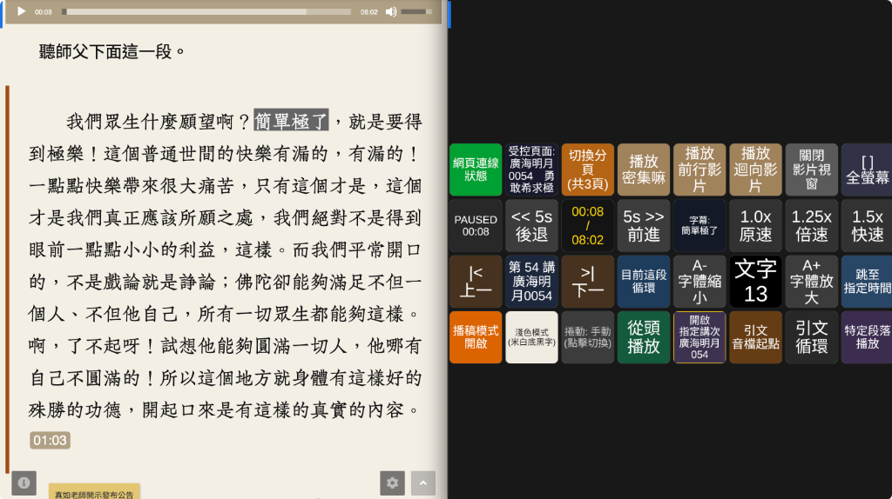

# 大慈恩官網 (AMRTF) Bitfocus Companion 遠端控制系統

[](amrtf-website-1.1.0.tgz)
[](https://bitfocus.io/companion)
[](chrome-extension/)
[](companion-module-amrtf/LICENSE)

一套專為導播、控場及研討學習打造的專業級遠端控制系統。透過 **Bitfocus Companion**（支援 Stream Deck、Loupedeck、Web 虛擬按鈕及實體控制器）即時操控 **大慈恩官網**（[amrtf.org](https://www.amrtf.org/)）的音訊播放、講記研討、顯示介面與前行迴向影片，並提供完整的雙向狀態即時反饋。



---

## 📦 快速安裝（已封裝發行檔）

本系統提供預先打包好的隨插即用安裝包，無需自行編譯：

1. **Bitfocus Companion 模組安裝包**：[`amrtf-website-1.1.0.tgz`](amrtf-website-1.1.0.tgz)
   - 進入 Companion 網頁後台 -> **Connections** / **Modules**。
   - 點擊 **「Import module package」**（匯入模組包），選擇 `amrtf-website-1.1.0.tgz` 即可一鍵安裝。
2. **Chrome 擴充套件封裝包**：[`amrtf-chrome-extension-v1.1.0.zip`](amrtf-chrome-extension-v1.1.0.zip)
   - 下載後解壓縮至任意資料夾。
   - 開啟 Chrome 瀏覽器進入 `chrome://extensions/`，開啟右上角「開發人員模式」。
   - 點擊「載入未封裝項目」，選擇解壓縮後的資料夾即可啟用。
   - *（原始碼目錄：[`chrome-extension/`](chrome-extension/)）*

---

## ✨ 核心特色功能

### 1. 🔄 自動偵測 GitHub 儲存庫更新
- **即時通知**：外掛內建自動版本檢測機制，背景定時（每 6 小時）向 GitHub 儲存庫比對最新發布版本。
- **更新圖示徽章**：當 GitHub 儲存庫有新版本發布時，Chrome 工具列外掛圖示會自動亮起 **`NEW`** 藍色提示徽章。
- **一鍵跳轉**：點開外掛彈窗即可看到新版本通知橫幅，並可直接點擊「前往 GitHub 下載更新」或點擊「🔍 檢查更新」手動即時查詢。

### 2. 🎵 專業音訊播放控制
- **基本控制**：播放、暫停、播放/暫停切換（按鈕背景色依播放中/暫停即時反饋）。
- **從頭播放**：一鍵返回 `00:00` 起點並自動從頭播放。
- **跳至指定時間**：支援 `MM:SS`（全形冒號 `：` 或半形冒號 `:`）或純秒數精準跳轉。
- **相對秒數跳轉**：支援倒退 5 秒、快進 5 秒、倒退 10 秒、快進 10 秒，亦支援旋鈕連續快進快退。
- **多段倍速調整**：`0.75x`、`1.0x` 原速、`1.25x`、`1.5x`、`1.75x`、`2.0x`。

### 3. 📖 引文段落與循環播放
- **跳至引文起點**：自動抓取頁面中引文或師父開示錄音時間標籤，瞬間定位跳轉。
- **引文循環播放**：精準循環研討段落，反覆聆聽不漏聽。
- **目前段落循環**：以目前播放段落為區間進行循環播放。
- **自訂特定段落播放**：可自選開始時間、結束時間，並選擇單次播放停止或自動循環。

### 4. 🎬 前行與迴向影片視窗
- **密集嘛**、**前行影片**、**迴向影片**：按下按鈕自動喚起網頁內建影片彈窗，並自動由頭開始播放。
- **關閉影片視窗**：關閉彈窗並立即停止影片聲音，避免背景持續發聲。

### 5. 🖥 畫面介面與顯示模式
- **深色 / 淺色主題切換**：米白底黑字與黑底白字切換，按鈕文字與底色即時同步。
- **播稿模式切換**：開啟時文字段落自動反白高亮，便於朗讀導讀。
- **文字大小調節**：小 (10)、中 (13)、大 (16)、特大 (19)、最大 (22) 與無段微調。
- **捲動模式切換**：按一下循環切換「手動」、「自動持續」與「自動區段」，按鈕動態呈現當前模式。
- **全螢幕控制**：一鍵將當前播放視窗全螢幕或解除全螢幕。

### 6. 📑 智慧多分頁管理與導航
- **多頁自動識別**：播放電腦開啟多個大慈恩分頁時，外掛自動偵測並同步清單。
- **按鈕即時切換**：透過「切換分頁」按鈕可輪播所有分頁；按鈕液晶即時呈現「受控頁面標題」與「總分頁數」。
- **講次切換**：上一講、下一講。
- **跨專題開新分頁**：支援真如老師開示（廣海明月、止觀初探、佛經故事等）與日常老和尚手抄稿各系列專題，設定講次後直接以新分頁開啟並聚焦。

### 7. 📡 MQTT 雙向控制與即時字幕推播
- **WebSocket 協定**：Chrome 外掛內建 MQTT over WebSocket 連線（`ws://` 預設埠 `1884`、`wss://` 預設埠 `8884`）。
- **即時文字推播**：即時廣播播放中段落手抄稿文字至 `{prefix}/status/current_subtitle`，可用於導播推流字幕、提詞機或第三方軟體。

---

## 🚀 快速上手教學

### 情境 A：單機運作（Companion 與 Chrome 在同台電腦）
1. 安裝 Chrome 擴充套件，點開外掛 Popup 確認主機 IP 為 `127.0.0.1`，Port 為 `9999`。
2. 開啟 Companion，匯入 `amrtf-website-1.1.0.tgz` 並建立連線。
3. 外掛圖示顯示「已連線」綠燈，即可直接使用 Presets 預設按鈕操控！

### 情境 B：跨電腦運作（Companion 導播主機與播放電腦分開）
1. **Companion 主機**（例如 IP: `192.168.1.100`）：
   - 模組 WebSocket 伺服器會自動於 `0.0.0.0:9999` 監聽。
2. **Chrome 播放電腦**：
   - 點擊 Chrome 工具列的「大慈恩 AMRTF Companion 橋樑」圖示。
   - 將 Companion 主機 IP 填入：`192.168.1.100`，連接埠 `9999`。
   - 點擊「儲存所有設定並重新連線」，狀態綠燈亮起即完成跨網連線！

---

## 🎛 預設按鈕群組 (Presets)

進入 Companion 的 **Presets** 頁面，已為您分門別類排配以下現成按鈕，可直接拖拉至您的實體按鈕或虛擬鍵盤：

| 群組分類 | 包含預設按鈕 |
| :--- | :--- |
| **0. 分頁切換與管理** | 切換分頁（含總頁數）、當前受控分頁標題與聚焦 |
| **1. 播放控制** | 播放/暫停切換、從頭播放、跳至指定時間、相對秒數旋鈕、後退5秒、前進5秒、後退10秒、前進10秒、目前時間/總時間、1.0x / 1.25x / 1.5x 倍速 |
| **2. 講次導航** | 當前講次標題與編號、上一講、下一講、自選講次開新頁面 |
| **3. 引文音檔與段落循環** | 跳至引文起點、引文循環播放、目前段落循環、播放特定段落 |
| **4. 介面與顯示模式** | 播稿模式切換、捲動模式輪播切換、全螢幕切換、深淺色模式切換、字體放大/縮小 |
| **5. 連線狀態與字幕** | 網頁連線狀態、當前字幕文字顯示（可即時閱讀目前朗讀手抄稿） |
| **6. 前行與迴向影片** | 播放密集嘛、播放前行影片、播放迴向影片、關閉影片視窗 |

---

## 💻 本地端開發與重新打包

若您希望自行調整程式碼或編譯：

```bash
# 進入 Companion 模組目錄
cd companion-module-amrtf

# 安裝依賴
npm install

# 編譯 TypeScript
npm run build

# 重新打包 Companion 模組包 (.tgz)
npm run package

# 打包 Chrome 擴充套件 (.zip)
cd ../chrome-extension
zip -r ../amrtf-chrome-extension-v1.1.0.zip . -x "*.DS_Store*"
```

---

## 📄 開源授權

本專案採用 [MIT License](companion-module-amrtf/LICENSE) 授權釋出，歡迎研討班學員與導播團隊自由使用與交流。
