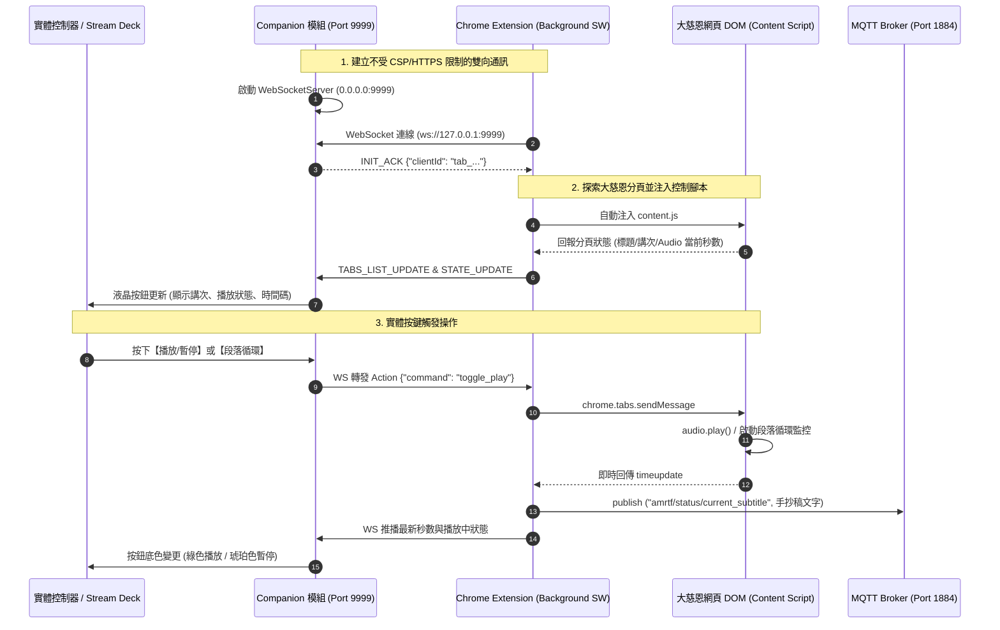

# 大慈恩官網 (AMRTF) Companion 遠端控制系統 — 深度架構規格與教材手冊

本手冊針對開源專案 [houtacheng/companion-module-amrtf-website](https://github.com/houtacheng/companion-module-amrtf-website) 進行系統級原始碼解構，深入解析現代瀏覽器高壓安全沙盒下，如何藉由「Chrome Extension MV3 + WebSocket 獨立伺服端」雙核心拓撲，無痛繞過 HTTPS Mixed Content 與 CSP 限制，實現實體控制器（Stream Deck / Loupedeck）與大慈恩官網（amrtf.org）音訊研討、段落字幕、多分頁切換的毫秒級雙向全雙工控制。

---

## 一、專案核心定位與設計哲學

### 1. 核心定位
* **現場研討與導播無縫聯動：** 在大型研討法會或線上導播現場，操作員需要高頻切換講次、播放/暫停師父開示音訊、精準循環特定手抄稿段落，若單純依靠滑鼠在瀏覽器視窗點擊，極易發生誤觸、脫焦或手忙腳亂。
* **實體外設化（Hardware Control of Web）：** 將純 Web 網頁轉化為具備「實體按鈕觸覺」的專業設備，支援 Stream Deck 實體液晶按鈕、輪播旋鈕以及 Companion Web 虛擬按鍵。
* **字幕推播擴展（Live Subtitle Pipeline）：** 內建 MQTT over WebSocket 推播管線，將播放中的手抄稿文字即時輸出給 OBS 跑馬燈字幕、現場大螢幕或第三方提詞機。

### 2. 系統架構能力矩陣
| 功能模組 | 技術核心 | 現場導播與操作價值 |
| :--- | :--- | :--- |
| **音訊播放控制** | HTML5 `<audio>` API、動態倍速、快進快退 | 盲按播放/暫停、按鈕液晶即時倒數與時間顯示 |
| **段落引文精準循環** | 正則匹配師父開示錄音時間標籤 (`#12:34`) | 針對研討爭議或重點段落反覆聆聽，自動循環不漏字 |
| **多分頁智慧切換** | `chrome.tabs` API、活動分頁心跳探測 | 單一按鈕輪播切換多個開啟的大慈恩講次，液晶直讀頁面標題 |
| **前行與迴向影片** | DOM Modal 模擬點擊、音視訊資源即時銷毀 | 一鍵喚起「密集嘛/前行/迴向」彈窗，關閉時強行靜音杜絕漏音 |
| **介面排版切換** | DOM 操作、主題切換、字體大小調節 | 遠端一鍵切換深色模式、播稿反白高亮與文字放大，適應遠距閱讀 |
| **MQTT 字幕廣播** | `mqtt.min.js` over WebSocket (`ws://` / `wss://`) | 即時廣播當前播放段落手抄稿文字至第三方導播系統與提詞機 |

---

## 二、雙核心分離架構與通訊拓撲



---

## 三、核心原始碼深度導讀

### 1. Chrome 擴充套件架構 (`chrome-extension/`)

#### (1) `background.js`（特權 Service Worker 橋接中樞）
* **沙盒穿透力：** 擴充套件的 Background Service Worker 運行於獨立沙盒中，擁有宣告的 `tabs`、`scripting` 與 `storage` 權限。它能夠自由發起 `ws://127.0.0.1:9999`，不受一般 HTTPS 網頁對 Insecure WebSocket 的封鎖。
* **多分頁池化管理 (`connectedTabs`)：**
  ```javascript
  // 動態過濾所有 amrtf.org 分頁
  const amrtfTabs = allTabs.filter((t) => t.url && t.url.includes('amrtf.org'));
  // 自動探測、注入 content.js 並維護生命週期
  ```
  當使用者在 Companion 上按下「切換分頁」時，`background.js` 負責調度 `chrome.tabs.update(nextTabId, { active: true })` 與 `chrome.windows.update(tab.windowId, { focused: true })`，將畫面瞬間拉至前台。
* **雙通道廣播 (WebSocket + MQTT)：** 接收到 Content Script 傳來的最新講記段落時，同步推播至 Companion 變數與 MQTT 主題，達成「控制與提詞雙分流」。

#### (2) `content.js`（DOM 與音訊掌控者）
* **音訊要素全面託管：**
  透過 `document.querySelector('audio')` 劫持大慈恩官網音訊實體，並監聽其 `play`、`pause`、`timeupdate`、`ended` 事件，以節流閥（Throttle）方式向 Background 回報進度，防止高頻通訊塞車。
* **複雜時間格式解析 (`parseTimeToSeconds`)：**
  大慈恩網站內存在中文全形冒號（`：`）與半形冒號（`:`），以及 `#MM:SS` 錨點格式：
  ```javascript
  function parseTimeToSeconds(str) {
    if (!str) return 0;
    const clean = String(str).trim().replace(/^#/, '');
    if (clean.includes(':') || clean.includes('：')) {
      const parts = clean.split(/[:：]/).map(Number);
      // 支援 MM:SS 與 HH:MM:SS 格式相容
    }
  }
  ```
* **影片視窗生命週期防護：**
  大慈恩官網的前行、密集嘛與迴向影片為動態 Modal。`content.js` 不僅能模擬點擊喚起彈窗，在收到關閉指令時，會主動抓取彈窗內的 `<video>` 執行 `video.pause()`，徹底消除「彈窗關閉但聲音仍在背景持續播放」的重大現場事故。

---

### 2. Companion 模組架構 (`companion-module-amrtf/`)

#### (1) `ws-server.ts`（全雙工 WebSocket 伺服中樞）
* **主動式連線管理：** Companion 模組本身作為 WebSocket Server 監聽 `0.0.0.0:9999`，採用 Client ID 機制標註連線來源，並透過心跳包（Heartbeat PING/PONG）維護連線健康度。
* **事件聚合與反饋推動：** 收到 `STATE_UPDATE` 時，即時呼叫 `instance.setVariableValues()` 與 `instance.checkFeedbacks()`，讓實體 Stream Deck 按鈕液晶在 50ms 內完成文字與底色重繪。

#### (2) `actions.ts` / `feedbacks.ts` / `presets.ts`
* **廣播級按鍵語意：** 遵循純符號與純動作本體設計，定義了播放/暫停、相對秒數旋鈕跳轉（$\pm 5\text{s}$ / $\pm 10\text{s}$）、倍速調整（`0.75x`~`2.0x`）、深淺色切換等完整行為。
* **動態液晶顯示：** 按鈕標籤動態嵌入 Companion 變數（如 `$(amrtf:current_time) / $(amrtf:total_time)`、`$(amrtf:active_tab_title)`），操作員低頭看按鍵即可掌握全盤狀態。

---

## 四、實戰避坑指南與極端邊界防護（五大現場死穴）

在現場控制系統設計中，本專案排查並解決了以下五大關鍵難題，值得所有遠控系統深思與借鑑：

### 1. 致命死穴一：HTTPS 混合內容 (Mixed Content) 與 CSP 鐵壁
* **問題症狀：** 若直接在 https://www.amrtf.org/ 的網頁腳本中執行 `new WebSocket('ws://127.0.0.1:9999')`，瀏覽器會立即報錯：`Mixed Content: The page was loaded over HTTPS, but attempted to connect to the insecure WebSocket endpoint 'ws://...'`，連線強制中斷。
* **解決方案：** 嚴格區分 **Content Script** 與 **Background Service Worker**。WebSocket 連線由 Background 發起，Content Script 只透過 Chrome 內部的 IPC（`chrome.runtime.sendMessage`）交換資料，成功繞過一切 Web 安全防護網。

### 2. 致命死穴二：Chrome 背景分頁節流 (Background Tab Throttling)
* **問題症狀：** 當大慈恩官網分頁被切換至背景時，Chromium 內核會自動對該分頁的 `setInterval` / `setTimeout` 進行降頻（由毫秒級降至 1 秒一次甚至休眠），導致按鈕倒數碼表卡死、循環播放判定失準。
* **解決方案：** 段落循環與時間監控緊密綁定在原生 HTML5 音訊的 `audio.addEventListener('timeupdate')` 事件上（此事件在音訊播放時不受分頁休眠影響），確保在背景分頁中依然能毫秒級精準攔截跳轉。

### 3. 致命死穴三：多開分頁競爭與焦點飄移
* **問題症狀：** 現場研討常同時開啟多個講次分頁，若每個分頁都向 Companion 爭搶控制權，會導致狀態跳動打架。
* **解決方案：** 實作 `activeTabId` 仲裁機制，預設優先受控於具備 `document.hasFocus()` 的分頁；同時支援 Companion 一鍵輪播切換受控分頁，切換時主動發出 `TAB_FOCUSED` 鎖定指令。

### 4. 致命死穴四：全形字元與多種時間格式容錯
* **問題症狀：** 研討學員或講師提供的手抄稿時間標記經常夾雜中文全形冒號（如 `12：34`）、無冒號秒數（如 `754`）或 `#錨點`。
* **解決方案：** 在正則表達式與時間解析引擎中，統一使用 `replace(/^#/, '').split(/[:：]/)`，相容所有主流輸入型態。

### 5. 致命死穴五：DOM 彈窗關閉後的「幽靈音頻」洩漏
* **問題症狀：** 在大慈恩網頁點擊關閉前行影片視窗，有些客製化彈窗組件僅隱藏了 CSS（`display: none`），底層 `<video>` 仍在後台持續播放發聲，干擾接續進行的研討。
* **解決方案：** 關閉動作觸發時，明確針對彈窗內所有 `<video>` 標籤強制執行 `.pause()` 與重置時間，確保音訊絕對靜默。

---

## 五、對我們系統（event-director）的架構借鑑與演進

1. **純 Web 設備控制的範式轉移：**
   * 本專案展示了控制「外部既有封閉網頁」的最佳架構模式（Chrome Extension 側載注入 + 本地 WebSocket 伺服器）。
   * 後續若需要遠控第三方法會直播頁面、YouTube 播放器或特定研討網站，可直接套用此套雙核心模板。
2. **MQTT 字幕跑馬燈接入：**
   * 我們的 `event-director` 主控台可增設 MQTT 監聽器，直接訂閱 `amrtf/status/current_subtitle`，現場大螢幕與監看視窗便能即時同步顯示講記開示字幕。
3. **擴充套件二開與打包規範：**
   * 本專案的構建流程非常標準（`npm run build`、`npm run package` 產出 `.tgz`、`zip` 產出 Chrome 外掛包），可作為後續外掛開發的標準範例。

---

> 📖 **收錄結算：** 完整原始碼與發行包已完整歸檔於 `event-director/docs/references/companion-module-amrtf-website/`，提供後續外設硬體連動與瀏覽器沙盒穿透之標準參考。
