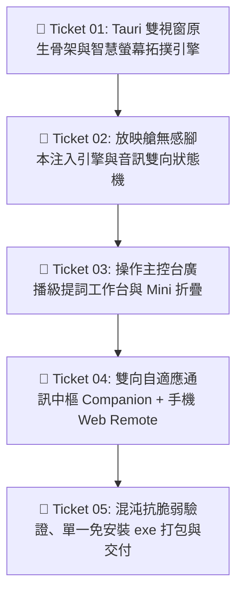

# 微工單任務清單: 大慈恩官網 (AMRTF) 獨立雙視窗播控艙 (TICKETS-004)

* **對應規格書**：[SPEC-004-amrtf-desktop-controller.md](file:///d:/AI-made/event-director/docs/specs/SPEC-004-amrtf-desktop-controller.md)
* **建立日期**：2026-09-17
* **負責架構師**：Antigravity (首席架構師)
* **工單切分原則**：示蹤彈垂直切片（Tracer-bullet Vertical Slices）+ 嚴格有向無環圖（DAG）依賴

---

## 依賴拓撲圖 (Dependency DAG)

---

## 工單細節 (Tickets)

### 🎫 Ticket 01: Tauri 雙視窗原生骨架與智慧螢幕拓撲引擎
* **交付價值（What to build）**：
  在 `projects/amrtf-desk` 建立 Tauri (Rust) 跨平台輕量骨幹，配置 `window_main`（操作主控台）與 `window_screen`（大慈恩放映艙）。實作 Windows 顯示器探測邏輯：外接雙螢幕時自動將放映艙移至第 2 螢幕並呼叫 `.set_fullscreen(true)` 獨佔大電視牆；單螢幕時兩視窗以 40%/60% 幾何並排。
* **前置依賴（Blocked by）**：無（Frontier，可立即動工）
* **指派特遣（Assigned Agent）**：Antigravity (首席架構師)
* **驗收標準（Acceptance Criteria）**：
  - [ ] 專案可透過 `cargo tauri dev` 正常啟動雙視窗。
  - [ ] 雙螢幕環境實測：放映視窗自動躍遷至副螢幕並無縫全螢幕化。
  - [ ] 單螢幕環境實測：主控台與放映艙左右並排呈現，零重疊阻擋。
  - [ ] 記憶體冷啟動佔用 $\le 50\text{MB}$。

---

### 🎫 Ticket 02: 放映艙無感腳本注入引擎與音訊雙向狀態機
* **交付價值（What to build）**：
  在放映艙 WebView2 載入 `https://www.amrtf.org` 時，原生注入 `amrtf-injected.js`。完整實現：劫持 `<audio>` 播放/暫停/跳轉；監聽 `timeupdate` 並節流推播至 Rust；正則解析師父引文時間標籤與段落循環；以及影片 Modal 喚起與關閉時強制執行 `video.pause()` 防漏音機制。
* **前置依賴（Blocked by）**：Ticket 01
* **指派特遣（Assigned Agent）**：1 號 Guardian (質檢官)
* **驗收標準（Acceptance Criteria）**：
  - [ ] 無需安裝任何 Chrome 外掛，放映艙打開即可即時接收播放/暫停指令。
  - [ ] 引文起點跳轉支援中文全形冒號（`12：34`）與半形冒號（`12:34`）容錯。
  - [ ] 關閉密集嘛/前行影片視窗時，音訊在 100ms 內徹底進入靜音暫停態。
  - [ ] 背景分頁切換時，`timeupdate` 事件持續穩定回傳，零掉格卡死。

---

### 🎫 Ticket 03: 操作主控台廣播級提詞工作台與 Mini 折疊
* **交付價值（What to build）**：
  打造操作主控台（`window_main`）的高對比深色 UI。頂部包含連線燈號與講次名稱；中央實裝**實時手抄稿提詞機（Prompter）**，文字隨音訊推進平滑高亮；底部配備巨型 50/50 盲按鍵（播放綠/暫停琥珀）、LED 等寬時間碼表、快退/快進 5 秒與深淺色切換鍵；右上角支援一鍵折疊為 480x120px 之置頂 Mini 懸浮條。
* **前置依賴（Blocked by）**：Ticket 02
* **指派特遣（Assigned Agent）**：2 號 Aura (前端美學家)
* **驗收標準（Acceptance Criteria）**：
  - [ ] 遵循廣播級零贅字標準，按鈕高度 $\ge 56\text{px}$，盲按 0 打滑。
  - [ ] 中央手抄稿提詞機文字與音訊同步滾動高亮，字體清晰抗疲勞。
  - [ ] 點擊「折疊 Mini」瞬間平滑縮小為懸浮條並開啟 `set_always_on_top(true)`。
  - [ ] 介面在 Windows 10/11 縮放（100%、125%、150%）下皆完美自適應。

---

### 🎫 Ticket 04: 雙向自適應通訊中樞 Companion + 手機 Web Remote
* **交付價值（What to build）**：
  在 Rust 原生層實作雙軌通訊：
  1. **Companion 通道**：內建 WebSocket Client 自動連向 `ws://127.0.0.1:9999`，接收來自 Stream Deck 的按鍵指令並反向推播變數。
  2. **手機 Web Remote 通道**：啟動輕量 HTTP/WebSocket 服務（Port 9998），主控台點擊「📱 手機遙控」即時生成區網 QR Code；手機相機掃碼免裝 App，直接開啟專用行動手把（超大觸控鍵，帶震動回饋）。
* **前置依賴（Blocked by）**：Ticket 03
* **指派特遣（Assigned Agent）**：Antigravity (首席架構師)
* **驗收標準（Acceptance Criteria）**：
  - [ ] 實體 Stream Deck 按鍵動作在 50ms 內驅動大慈恩音訊播放與提詞機跳轉。
  - [ ] 手機掃碼開啟網頁後，點擊「播放/暫停」延遲 $\le 50\text{ms}$，並觸發 30ms 觸覺震動。
  - [ ] 支援多人同時開啟手機網頁遙控，狀態全雙工即時同步。

---

### 🎫 Ticket 05: 混沌抗脆弱驗證、單一免安裝 exe 打包與交付
* **交付價值（What to build）**：
  編寫 `verify-amrtf-desk.mjs` 實施端對端無頭驗收測試（驗證雙視窗生命週期、50/50 盲按狀態機、防漏音與延遲）；執行 `cargo tauri build` 編譯出單一可攜式免安裝 `AMRTF-Desk.exe`（<10MB）；生成雙向桌面捷徑，交付完整的《30秒快速使用說明書》。
* **前置依賴（Blocked by）**：Ticket 04
* **指派特遣（Assigned Agent）**：1 號 Guardian (質檢官)
* **驗收標準（Acceptance Criteria）**：
  - [ ] 自動化端對端驗收腳本全項 100% 綠燈通過。
  - [ ] 產出單一免安裝 `.exe` 體積 $\le 10\text{MB}$，雙擊直接啟動。
  - [ ] 桌面建立專屬 `.lnk` 捷徑與純 ASCII 啟動蹦床。
  - [ ] DEVLOG.md 與 PROJECT_BLUEPRINT.md 同步知識固化。
