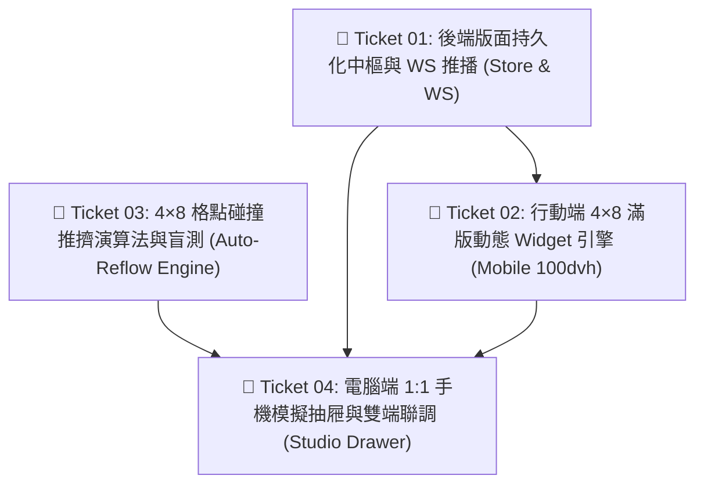

# AMRTF-Desk 行動端 4 × 8 自訂畫布微型工單清單 (Micro-Tickets DAG)

> 關聯規格書：[`projects/amrtf-desk/docs/specs/mobile-4x8-canvas-spec.md`](file:///d:/AI-made/projects/amrtf-desk/docs/specs/mobile-4x8-canvas-spec.md)  
> 建立日期：2026-09-20  
> 執行團隊：Antigravity (首席架構師) ＋ Guardian (質檢官) ＋ Aura (美學家)

---

### 🎫 Ticket 01: 後端版面持久化中樞與 WebSocket 熱推播管線
* **交付價值（What to build）：** 建立 `src/server/mobile-layout-store.js`，負責管理行動端 4×8 佈局配置檔案（`data/mobile-layout.json`）。提供 REST API（`GET /api/mobile-layout`、`POST /api/mobile-layout`）供讀寫，並在寫入時向現有 WebSocket 用戶端廣播 `mobile_layout_update` 信令；提供預設「精簡 6 鍵」與「全功能」兩種初始模板。
* **前置依賴（Blocked by）：** 無（可立即啟動）
* **指派特遣（Assigned Agent）：** Antigravity (首席架構師) ＋ Guardian (質檢官審查)
* **驗收標準（Acceptance Criteria）：**
  - [x] 若 `data/mobile-layout.json` 不存在，自動初始化為標準預設佈局（含提詞機與主控鍵）。
  - [x] `POST /api/mobile-layout` 寫入時具備結構校驗（防畸形資料與超出 4×8 邊界）。
  - [x] 保存完成後於 10ms 內透過 WebSocket 觸發廣播。
  - [x] 執行單元測試 `node tests/test-mobile-layout-store.mjs` 100% 綠燈通過。

---

### 🎫 Ticket 02: 行動端 `/mobile` 4×8 滿版自適應與動態 Widget 渲染引擎
* **交付價值（What to build）：** 徹底升級 `src/server/web-remote.js` 行動端頁面。移除寫死之固定 6 鍵 HTML，改為以 CSS `100dvh` 與 `grid-template-columns: repeat(4, 1fr)`、`grid-template-rows: repeat(8, 1fr)` 渲染動態 Widget；將提詞機、資訊標題與按鈕群積木化；監聽 WebSocket `mobile_layout_update` 信令達成零閃爍平滑重排，並以 `env(safe-area-inset-bottom)` 徹底杜絕系統列切字。
* **前置依賴（Blocked by）：** Ticket 01
* **指派特遣（Assigned Agent）：** 2 號特遣 Aura (前端美學家) ＋ Antigravity
* **驗收標準（Acceptance Criteria）：**
  - [x] `/mobile` 頁面以現代 4×8 CSS Grid 呈現，按鈕根據 JSON 設定之 `col, row, w, h` 精準對位。
  - [x] 模擬不同螢幕長度時，8 行 4 列始終 100% 撐滿視口，無垂直滾動條。
  - [x] 提詞機文字在包含 Android 虛擬鍵或 iPhone 橫條的手機上 100% 完整露出，絕不切字。
  - [x] 收到推播時，頁面無需 Reload，音訊播放不中斷，DOM 節點平滑對位更新。

---

### 🎫 Ticket 03: 4×8 格點碰撞推擠演算法 (Auto-Reflow Engine) 與高壓單元盲測
* **交付價值（What to build）：** 建立純函數模組 `src/desk/modules/mobile-reflow-engine.js`。實作在 4 欄 × 8 列（32 格）二維空間內的佔用計算、元件拖曳碰撞檢測、自動推擠演算法（當 A 元件放大或移入撞到 B 元件時，B 元件自動順移至相鄰可用空格，支援骨牌效應連鎖順延），以及 32 格完全塞滿時的邊界阻斷熔斷判定。
* **前置依賴（Blocked by）：** 無（可立即啟動，與 Ticket 01 並行！）
* **指派特遣（Assigned Agent）：** 1 號特遣 Guardian (質檢官) ＋ Antigravity
* **驗收標準（Acceptance Criteria）：**
  - [x] 空白格點置放：無障礙直接佔位。
  - [x] 單一碰撞推擠：A 放大為 2×2 時，相鄰 1×1 元件精準向右或向下推移 1 格。
  - [x] 骨牌連鎖推擠：連續障礙物自動沿格點流遞延重排。
  - [x] 滿格熔斷防護：全滿 32 格無處可排時，回傳 `overflow: true` 阻斷操作。
  - [x] 撰寫極限邊界單元測試 `tests/test-reflow-engine.mjs`，盲測 10 組極端案例 100% 通過。

---

### 🎫 Ticket 04: 電腦端 1:1 手機模擬編排抽屜 (Mobile Studio Drawer) 與雙端聯調驗證
* **交付價值（What to build）：** 於電腦端 AMRTF-Desk 控制台頂部新增 `📱 手機編排` 按鈕，點擊後滑出毛玻璃抽屜面板。左半側為 1:1 真實比例之直向手機外框（4×8 磁吸畫布），右半側為按鈕庫存盒（Toolbox）；支援滑鼠拖曳進出、右下角 `⤡` 磁吸拉伸把手與 `1×1~4×2` 快捷尺寸膠囊；放開滑鼠調用 Reflow 引擎並自動保存至 Ticket 01，觸發真實手機畫面即時響應。
* **前置依賴（Blocked by）：** Ticket 01, Ticket 02, Ticket 03
* **指派特遣（Assigned Agent）：** Antigravity (首席架構師) ＋ Aura (美學交互) ＋ Guardian (現場物證驗收)
* **驗收標準（Acceptance Criteria）：**
  - [x] 控制台頂部按鈕點擊後，以立體懸浮抽屜平滑滑出手機模擬器。
  - [x] 支援在庫存盒與畫布間自由拖曳，拉出畫布或點 ✕ 自動歸還庫存。
  - [x] 懸浮把手可將按鈕拉伸為 2×1、2×2、4×1、4×2 等尺寸，並觸發智慧推擠。
  - [x] 拖曳/改大小放開滑鼠後，伺服器落盤並推播，真實手機端同步平滑重排。
  - [x] Win32 HWND / 特權 CDP 截取現場雙端對齊快照，確認 100% 正常運作。
