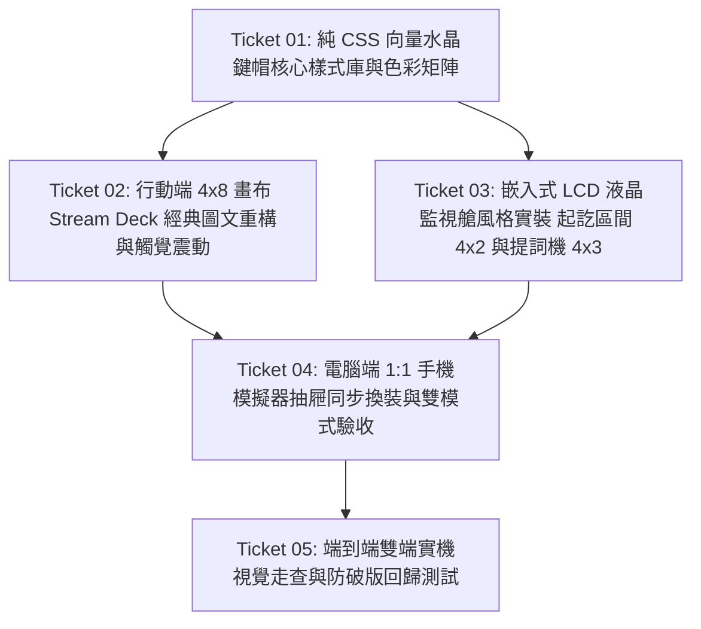

# 任務工單拆解: Stream Deck 3D 透光水晶鍵帽與嵌入式 LCD 操作艙 (TICKETS-005)

> 文件代號：`TICKETS-005-stream-deck-crystal-caps`  
> 依據規格：[`SPEC-005-stream-deck-crystal-caps.md`](file:///d:/AI-made/projects/amrtf-desk/docs/specs/stream-deck-crystal-caps-spec.md)  
> 建立日期：2026-09-20  

---

## 工單相依有向圖 (Dependency DAG)

---

### 🎫 Ticket 01: 純 CSS 向量水晶鍵帽核心樣式庫與色彩矩陣
* **交付價值（What to build）：**
  - 建立專屬純 CSS 水晶鍵帽設計系統（0 圖片依賴、向量無失真、60fps 硬體加速）；
  - 實作外層金屬沉雕凹槽（`linear-gradient(145deg, #252a34, #0e1117)` ＋ 1px 內凹倒角）；
  - 實作內層壓克力水晶鍵帽（雙層微凸高光 `box-shadow: inset 0 1.5px 1.5px rgba(255,255,255,0.7), inset 0 -3px 6px rgba(0,0,0,0.6)`）；
  - 實作頂部拋物弧面反光罩（`::before` 42% 高度漸層水晶拋光光澤）；
  - 實作高彩度色彩矩陣（極光深藍、警示高亮紅、琥珀金、霓虹紫、黑曜炭黑）；
  - 實作三維機械微動開關交互（`:active` 下沉 2px、scale 0.96、內陰影加深至 0.9、光影動態收縮）。
* **前置依賴（Blocked by）：** 無（可立即開始）
* **指派特遣（Assigned Agent）：** 2 號 Aura (前端美學家) + Antigravity (首席架構師)
* **驗收標準（Acceptance Criteria）：**
  - [ ] CSS 包含完整 `.grid-btn-housing`、`.grid-btn-crystal`、`::before` 弧形反光與 `:active` 下沉微交互；
  - [ ] 5 種以上廣播專用色相高飽和背光；
  - [ ] 0 額外圖片資源載入，純靠 GPU 渲染。

---

### 🎫 Ticket 02: 行動端 4×8 畫布 Stream Deck 經典圖文重構與觸覺震動
* **交付價值（What to build）：**
  - 全面升級 `src/server/web-remote.js` 網格渲染器；
  - 每個按鈕內部重構為 Stream Deck 經典結構：中央 `24px~28px` 巨型高對比立體圖示（`.btn-glyph`）＋ 底部 `10px~11px` 微型液晶標籤（`.btn-label`）；
  - 觸控事件加入 `navigator.vibrate?.(15)` 觸覺微動開關震動反饋；
  - 確保在手機 100dvh 與安全區域（safe area）內 32 格均勻分佈、無黑邊、零捲軸。
* **前置依賴（Blocked by）：** Ticket 01
* **指派特遣（Assigned Agent）：** Antigravity (首席架構師)
* **驗收標準（Acceptance Criteria）：**
  - [ ] 手機端開啟後，所有按鍵呈現晶瑩剔透的水晶鍵帽外觀；
  - [ ] 按下按鍵時，手指能感受到 15ms 微動震動與視覺 2px 下沉反饋；
  - [ ] 圖示居中醒目、文字微縮置底，徹底消除字體過大導致的擁擠感。

---

### 🎫 Ticket 03: 嵌入式 LCD 液晶監視艙風格實裝（起訖區間 4×2 與提詞機 4×3）
* **交付價值（What to build）：**
  - 升級 `widget-interval`（起訖區間控制模組）與 `widget-teleprompter`（提詞機）的視覺樣式；
  - 外框包覆黑鉻沉雕邊框與防眩光深色玻罩；
  - 下拉選單與時鐘/字幕改為螢光墨綠 `#00e676` 與賽博藍 `#00e5ff` 高對比液晶儀表字體；
  - 模組內部控制鍵（▶ 區間、⏹ 急煞）化身為嵌入式微型水晶鍵。
* **前置依賴（Blocked by）：** Ticket 01
* **指派特遣（Assigned Agent）：** 2 號 Aura (前端美學家)
* **驗收標準（Acceptance Criteria）：**
  - [ ] 起訖模組與提詞機外觀如同 Stream Deck 上嵌入的多格 LCD 監視器；
  - [ ] 下拉選單與控制按鈕操作流暢，功能 100% 完好無損。

---

### 🎫 Ticket 04: 電腦端 1:1 手機模擬器抽屜同步換裝與雙模式驗收
* **交付價值（What to build）：**
  - 升級 `src/desk/modules/mobile-studio-drawer.js` 與 `src/desk/desk.css`；
  - 模擬框中的 32 格按鍵與右側庫存盒按鈕同步套用水晶鍵帽樣式；
  - 在「🎮 真機預覽操作模式」下，點擊按鈕具備相同的機械下沉與光影反饋，且可直控放映艙；
  - 在「🛠️ 編輯排版模式」下，拖曳、調整尺寸把手與移除按鈕與水晶外觀完美契合。
* **前置依賴（Blocked by）：** Ticket 01, Ticket 02, Ticket 03
* **指派特遣（Assigned Agent）：** Antigravity (首席架構師)
* **驗收標準（Acceptance Criteria）：**
  - [ ] 電腦端手機編排抽屜中的模擬器與手機端視覺 1:1 完全一致；
  - [ ] 預覽模式點按體驗清脆爽快，編輯模式排版無阻礙。

---

### 🎫 Ticket 05: 端到端雙端實機視覺走查與防破版回歸測試
* **交付價值（What to build）：**
  - 執行現有自動化測試套件（Store 持久化、Reflow 引擎盲測、E2E WebSocket 熱同步），確保數據層零破壞；
  - 透過瀏覽器擷取視覺快照，檢驗 3D 弧面反光與凹槽層次；
  - 固化成果與心得至 `DEVLOG.md`。
* **前置依賴（Blocked by）：** Ticket 04
* **指派特遣（Assigned Agent）：** 1 號 Guardian (質檢官) + Antigravity
* **驗收標準（Acceptance Criteria）：**
  - [ ] 全套單元與 E2E 測試 100% 綠燈；
  - [ ] 實機視覺與長官出示之 Stream Deck 照片精神 100% 契合；
  - [ ] 記錄踩坑與心得至開發日誌。
