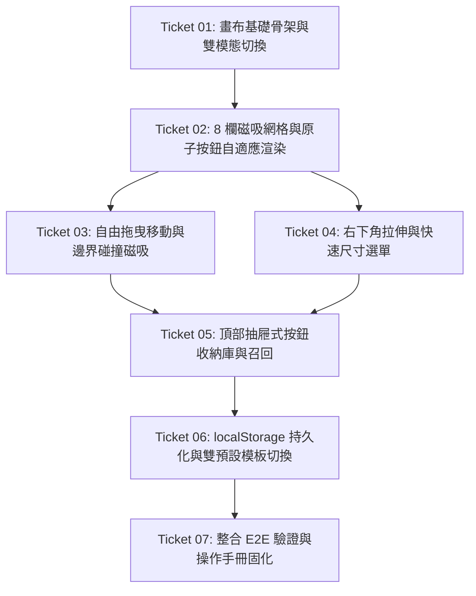

# AMRTF-Desk 廣播級 8 欄磁吸畫布與自訂操作艙任務工單 (Tickets DAG)

## 工單相依有向無環圖 (DAG)

---

### 🎫 Ticket 01: 畫布基礎骨架與雙模態切換 (Run vs Edit Mode)
* **交付價值（What to build）：**
  - 在操作艙頂部導航列注入 `[🛠️ 編輯佈局]` 開關按鈕與快捷鍵監聽（`Ctrl + E` / `Esc`）；
  - 實作雙模態狀態機（`run` vs `edit`）：進入編輯模式時全螢幕邊框泛起琥珀黃呼吸光暈，阻斷按鈕原本的音訊/影片觸發事件，並將按鈕轉為可配置外框；退出時立即恢復堅挺的作業態。
* **前置依賴（Blocked by）：** 無（可立即啟動）
* **指派特遣（Assigned Agent）：** Antigravity (首席架構師) ＋ 2 號 Aura (美學家)
* **涉及檔案：**
  - `src/desk/index.html`
  - `src/desk/desk.css`
  - `src/desk/modules/deck-canvas.js` (NEW)
* **驗收標準（Acceptance Criteria）：**
  - [ ] 點擊右上角 `[🛠️ 編輯佈局]` 或按下 `Ctrl + E`，畫面頂部出現醒目琥珀黃光暈，按鈕變為 `[💾 完成儲存]`。
  - [ ] 在自訂模式下點擊任何播控按鈕，不會觸發音訊播放或影片彈窗。
  - [ ] 再次點擊 `[💾 完成儲存]` 或按下 `Esc`，光暈消失，點擊按鈕恢復正常的導播播控功能。

---

### 🎫 Ticket 02: 8 欄磁吸網格與原子按鈕自適應渲染 (8-Col Grid & Responsive Buttons)
* **交付價值（What to build）：**
  - 重構主操作區為 `.deck-grid-8`（8 欄等分 CSS Grid 容器），對標 Stream Deck XL；
  - 將既有所有播控、模式與影片彈窗按鈕拆解為獨立原子組件（帶有唯一 `data-btn-id` 與尺寸規格 `data-cols` / `data-rows`）；
  - 「引文快速跳轉區」封裝為 $8\times2$ 獨立卡片模組（Widget）；
  - 實作「階梯式人體工學響應」CSS，使大鍵（$4\times2$）自動放大文字與圖標至 28px/36px 並垂直置中。
* **前置依賴（Blocked by）：** Ticket 01
* **指派特遣（Assigned Agent）：** 2 號 Aura (美學家)
* **涉及檔案：**
  - `src/desk/desk.css`
  - `src/desk/index.html`
  - `src/desk/desk.js`
* **驗收標準（Acceptance Criteria）：**
  - [ ] 所有按鈕皆呈現在 8 欄網格中，無像素重疊或邊界穿透。
  - [ ] 手動設定 `data-cols="4"` 與 `data-rows="2"` 時，按鈕呈現霸氣醒目大鍵，字體與圖標比例和諧。
  - [ ] 手抄稿動態引文列表作為完整卡片模組穩定渲染，功能不受影響。

---

### 🎫 Ticket 03: 自由拖曳移動與邊界碰撞磁吸 (Drag & Drop Matrix Engine)
* **交付價值（What to build）：**
  - 在自訂模式下，操作員按住按鈕本體可任意拖動位置；
  - 實作即時網格佔用檢測與周圍按鈕避讓計算，拖曳時浮現半透明虛線磁吸框；
  - 放開滑鼠時自動磁吸至目標格位，並嚴格限制在 8 欄邊界之內，絕不超出螢幕。
* **前置依賴（Blocked by）：** Ticket 02
* **指派特遣（Assigned Agent）：** Antigravity (首席架構師)
* **涉及檔案：**
  - `src/desk/modules/deck-canvas.js`
  - `src/desk/desk.css`
* **驗收標準（Acceptance Criteria）：**
  - [ ] 自訂模式下可流暢拖曳任一按鈕變更排列順序。
  - [ ] 拖曳過程中有清楚的磁吸目標預覽框（Ghost Box）。
  - [ ] 拖出 8 欄範圍時自動限制在邊界內，鬆開滑鼠後精準歸位。

---

### 🎫 Ticket 04: 右下角拉伸與快速尺寸選單 (Dual-Track Resize UX)
* **交付價值（What to build）：**
  - 自訂模式下，每個按鈕右下角呈現 `⤡` 拉伸握柄，拖動即可實時拉長拉高（支援 $1\times1 \sim 8\times2$）；
  - 同時支援點擊按鈕或右鍵呼出快速尺寸浮動面板（`1x1`、`2x1`、`2x2`、`4x2`），點擊瞬間切換；
  - 縮放時即時連動 Ticket 02 之動態階梯字體樣式。
* **前置依賴（Blocked by）：** Ticket 02
* **指派特遣（Assigned Agent）：** Antigravity (首席架構師) ＋ 2 號 Aura (美學家)
* **涉及檔案：**
  - `src/desk/modules/deck-canvas.js`
  - `src/desk/desk.css`
* **驗收標準（Acceptance Criteria）：**
  - [ ] 按住右下角 `⤡` 可任意拉動改變佔用格數，放手即磁吸定型。
  - [ ] 點選快速尺寸選單中的 `4x2`，按鈕瞬間平滑擴展為半版巨型主控鍵。
  - [ ] 縮放過程文字與圖標即時升級為對應比例，不變形不破圖。

---

### 🎫 Ticket 05: 頂部抽屜式按鈕收納庫與召回 (Drawer Dock & Button Recall)
* **交付價值（What to build）：**
  - 自訂模式下，按鈕右上角浮現紅色 `✕` 關閉按鈕，點擊後按鈕從畫布淡出隱藏；
  - 頂部導航列下方滑出抽屜式「📦 按鈕倉庫（Dock）」，所有被隱藏的按鈕收納為標籤條列於其中；
  - 點擊倉庫中的任一標籤，該按鈕立即召回並磁吸於網格可用空間的第一個空位；
  - 若所有按鈕皆被隱藏，畫布顯示防呆提示「目前畫布為空，請從上方倉庫召回按鈕」。
* **前置依賴（Blocked by）：** Ticket 03, Ticket 04
* **指派特遣（Assigned Agent）：** 2 號 Aura (美學家)
* **涉及檔案：**
  - `src/desk/index.html`
  - `src/desk/desk.css`
  - `src/desk/modules/deck-canvas.js`
* **驗收標準（Acceptance Criteria）：**
  - [ ] 點擊 `✕` 能順暢將不需要的按鈕（如迴向影片）收進頂部抽屜倉庫。
  - [ ] 點擊倉庫標籤能將按鈕精準放回網格畫布。
  - [ ] 作業態下（Run Mode）收納庫自動滑收隱藏，不干擾導播視線。

---

### 🎫 Ticket 06: localStorage 持久化與雙預設模板切換 (Persistence & Presets)
* **交付價值（What to build）：**
  - 每次位置移動、尺寸變更或隱藏操作，秒級自動序列化並寫入瀏覽器 `localStorage`；
  - 內建兩套官方模板：「全功能導播模板（Full Director）」與「研討極簡模板（Minimal 4-Key：僅保留播放、段落、A-B、靜音）」；
  - 提供 `[↺ 恢復預設]` 安全閥，以及 `[📤 匯出 JSON]` / `[📥 匯入 JSON]` 配置檔案能力（附 Schema 防禦校驗）。
* **前置依賴（Blocked by）：** Ticket 05
* **指派特遣（Assigned Agent）：** 1 號 Guardian (質檢官) ＋ Antigravity (首席架構師)
* **涉及檔案：**
  - `src/desk/modules/deck-storage.js` (NEW)
  - `src/desk/modules/deck-canvas.js`
  - `src/desk/index.html`
* **驗收標準（Acceptance Criteria）：**
  - [ ] 調整佈局後關閉瀏覽器或重啟 `AMRTF-Desk.bat`，自訂排版 100% 保持。
  - [ ] 點擊「極簡模板」，瞬間切換為 4 顆醒目大鍵；點擊 `[↺ 恢復預設]` 完美還原官方全功能。
  - [ ] 匯入無效或毀損之 JSON 時，觸發安全告警並阻斷覆蓋，維持原有排版。

---

### 🎫 Ticket 07: 整合 E2E 驗證與操作手冊固化 (E2E Test & Knowledge Solidification)
* **交付價值（What to build）：**
  - 執行真實啟動測試，驗證 `AMRTF-Desk.bat` 雙擊啟動後的視窗渲染與 Win32 HWND 健全度；
  - 進行多輪極端邊界測試（狂點切換、高頻縮放、全隱藏召回）；
  - 將新增踩坑經驗寫入 [DEVLOG.md](file:///d:/AI-made/projects/amrtf-desk/DEVLOG.md)（亮點 99），更新 [PROJECT_BLUEPRINT.md](file:///d:/AI-made/PROJECT_BLUEPRINT.md)，並在使用者說明文件中記錄自訂佈局操作指引。
* **前置依賴（Blocked by）：** Ticket 06
* **指派特遣（Assigned Agent）：** 1 號 Guardian (質檢官) ＋ Antigravity (首席架構師)
* **涉及檔案：**
  - `projects/amrtf-desk/DEVLOG.md`
  - `projects/amrtf-desk/PROJECT_BLUEPRINT.md`
  - `projects/amrtf-desk/使用說明.txt`
* **驗收標準（Acceptance Criteria）：**
  - [ ] 通過全流程 E2E 驗證，0 報錯、0 崩潰。
  - [ ] `DEVLOG.md` 完整記載架構突破與避坑細節。
  - [ ] 操作手冊同步完成。
